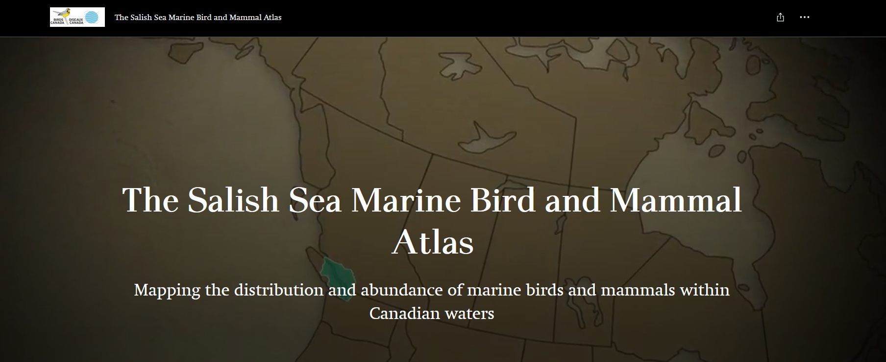

---
output:
  pdf_document: default
  html_document: default
---

# British Columbia Marine Bird Atlas (BCMA) {#BCMA3}

```{r tidyr3, echo = FALSE, message = FALSE, warning = FALSE}

library(knitr)
opts_chunk$set(tidy.opts=list(width.cutoff=50), tidy = FALSE)

```

```{r image, echo=FALSE, out.width="700px", fig.align='center'}

```

## Quick Data Overview {#BCMA3.1}

| Data        | British Columbia Marine Bird Atlas (BCMA)                                                                                                              |
|--------------------------|----------------------------------------------|
| Owner       | Birds Canada/ Pacific Wildlife Foundation                                                                                                              |
| Status      | Not Active                                                                                                                                             |
| Years       | 2008-2015                                                                                                                                              |
| Seasons     | Monthly surveys, for a full year with some variability                                                                                                 |
| Sampling    | Vessel transects along designated routes, over different regions of the Canadian Salish Sea                                                            |
| Data Access | Available directly in R, with permission from Birds Canada or through the [NatureCounts](https://naturecounts.ca/nc/default/searchquery.jsp) webportal |
| Contact     | [acouturier\@bsc-eoc.org](mailto:acouturier@bsc-eoc.org){.email}                                                                                       |

[BCMA Website](https://storymaps.arcgis.com/stories/643e7710d56a427487e4fbe04cb8064c)

## Data Collection Protocol {#BCMA3.2}

Protocols are published in technical reports (below), which may differ slightly between years since each year the survey focused on a different geographic region. Also note that the year long survey period straddles a calendar year.

In short, counts of birds and marine mammals were made from boat moving at 10-12 knots within a 200 m (100m on either side) wide transect parallel to the shoreline. Surveyors also recorded the number of birds and mammals seen beyond 100 m of the boat. Two observers scanned for birds and mammals on either side of the boat. One observer calls out waypoints approximately every 250-500 meters (depending on survey year), while the other observer recorded the data. Binoculars are used to assist in counting and identifying distant birds and mammals. In most situations, birds and mammals are counted individually. Flocks of more than about 100 individual birds were estimated by summing the number by groups of 10s of individuals.

Technical reports can be found here:

-   [The Southern Gulf Islands (2008-2010)](https://pwlf.ca/wp-content/uploads/2019/04/Davidson2010SGI.pdf)

-   [Burrard Inlet and Indian Arm (2011-2013)](https://pwlf.ca/wp-content/uploads/2019/04/mbbi.pdf)

-   Boundary Bay (2007-2008) (no report available)

-   [Howe Sound (2014-2015)](https://secureservercdn.net/45.40.148.234/g5z.e05.myftpupload.com/wp-content/uploads/2021/10/Howe_Sound_Report_Final.pdf)

-   [The Fraser River Estuary (2016-2017)](https://pwlf.ca/wp-content/uploads/2019/04/ferf.pdf)

## Avian Data Collected {#BCMA3.3}

Counts of waterbird seen during a survey are compiled at the scale of the point along a survey transect (i.e., the maximum count per species) on each monthly survey. These observations are divided into Port Section, Central Section, Board Section and total ObservationCount. The dataset is not zero-filled.

Taxonomic Authority = AOU

## Auxiliary Data Collected {#BCMA3.4}

-   Observer information: observer ID

-   Survey Information: time observation started, time observation ended, duration in hours

-   Survey Condition: none rcorded

## Data Access, Permission, and Format {#BCMA3.5}

Data can be freely accessed through the NatureCounts data [download portal](https://naturecounts.ca/nc/default/searchquery.jsp) or directly through the naturecounts R package, which I will demonstrate later in this chapter. The BCMA is an Access Level 5 dataset, meaning a data request form **is not** required to get access to this dataset, and it can be openly downloaded directly into R using the naturecounts R package.

Data are formatted using a standardized schema that is a core standard of the [Avian Knowledge Network](https://avianknowledge.net/) and which feeds into [GBIF](https://www.gbif.org/).This format is called the Bird Monitoring Data Exchange ([BMDE](https://naturecounts.ca/nc/default/nc_bmde.jsp)), which includes 169 core fields used for capturing all metric and descriptors associated with bird observations.

## Data Use Considerations {#BCMA3.6}

Measures of effort are innate to the dataset. Survey duration (column `DurationinHours`) can be used to make effort correction to counts. 

## Data Processing {#BCMA3.7}

Some basic R scripts are provided for importing and compiling the BCMA data. How you process a dataset will largely depending on the research question you are asking and the analytical approach you are taking. These scripts are therefore not suitable for all data processing needs.

If you are new to the naturecounts R package, I recommend you start by reviewing the [Introductory R Tutorial](https://birdscanada.github.io/NatureCounts_IntroTutorial/). Those materials will not be repeated here.

Since the dataset is an Access Level 5, a `request_id` is not need to access the dataset. The `username` should be replaced with your own credentials. To retrieve all the columns, you will want the `fields_set` to be extended (as below).

```{r BCMA access, eval=FALSE}

#BCMA<-nc_data_dl(collection="BCMA", username = "YOUR USERNAME", info="MY REASON", fields_set = "extended")

```

This dataframe now contains all the data that you would need for an analysis. Recall that this is not zero filled. You can create a unique "Events matrix" to zero-fill your dataframe.

.
