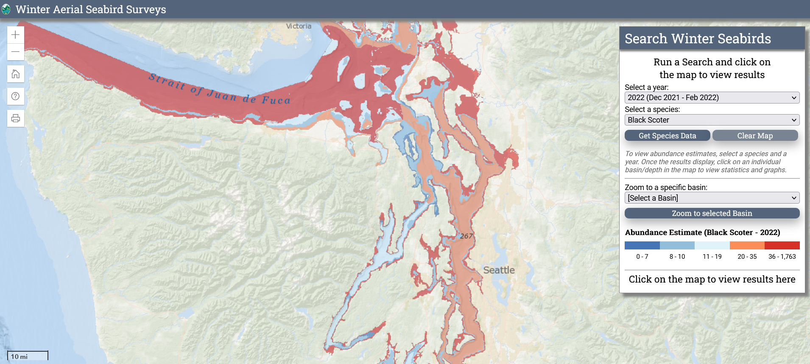

---
output:
  pdf_document: default
  html_document: default
---

# MASS {#MASS6}

[**Midwinter Aerial Seabird Survey**]((https://wdfw.wa.gov/species-habitats/at-risk/species-recovery/seabirds/surveys-winter-aerial).)

```{r tidyr6, echo = FALSE, message = FALSE, warning = FALSE}

library(knitr)
opts_chunk$set(tidy.opts=list(width.cutoff=50), tidy = FALSE)

```

```{r image, echo=FALSE, out.width="700px", fig.align='center'}

```

## Quick Data Overview {#MASS6.1}

| Data        | Midwinter Aerial Seabird Survey (MASS)                                                                                                          |
|------------------|------------------------------------------------------|
| Owner       | Washington Department of Fish and Wildlife (WDFW)                                                                                               |
| Status      | Active                                                                                                                                          |
| Years       | 1994 - present                                                                                                                                  |
| Seasons     | Early December until the surveys are complete, which is usually in February                                                                     |
| Sampling    | Aerial flights along fixed routes                                                                                                               |
| Data Access | [Open Data Portal](https://data-wdfw.opendata.arcgis.com/documents/wdfw)                                                                        |
| Contact     | [Joseph.Evenson\@dfw.wa.gov](mailto:Joseph.Evenson@dfw.wa.gov){.email} and [Kyle.Spragens\@dfw.wa.gov](mailto:Kyle.Spragens@dfw.wa.gov){.email} |

## Data Collection Protocol {#MASS6.2}

*Links to a data collection sheet and protocol if available*

Surveys are flown each year by a crew of experienced WDFW biologists from early December until the surveys are complete, which is usually by the end of January or February. The surveys were designed to occur during midwinter, when sea ducks and other marine birds are least likely to be migrating. Flights are conducted at an altitude of 200 feet (61 meters) above the water and at an airspeed of 85-90 knots. Each biologist counts all marine bird and mammal observations within a 50-meter strip along their respective side of the aircraft. The surveys cover the entire shoreline of the inland marine waters of Washington. The offshore waters are sampled by flying a pre-designed zigzag pattern.

MASS data processing notes can be found online by navigating to the ESRI [open data portal](https://www.arcgis.com/home/item.html?id=0d57403ea9eb45b7a8acabf3dd58c7b0). Download the data by clicking the `Open` button, then save the files to the `Data` directory in this project. Information on data processing can be found in the `Midwinter Aerial Seabird Surveys Geoprocessing Metadata Notes.pdf`.

In short, during pre-processing the flight crew transcribe voice recordings of their observations, linking them with a series of GPS observation point locations collected during the survey. The results are two tab-delimited text files containing observation and track-log locations. When the surveyors have completed their transcription, a series of geoprocessing scripts are run which omit off-effort observations, calculate the extent of surveyed areas, and add appropriate attribute information to both observations and survey strips.

## Avian Data Collected {#MASS6.3}

The `PSEMP_Survey_Observations` layer stores the processed bird observation data, including total `ObservationCount` of species on a given transect.

There are three additional table which are used to assign species to species codes, scientific names, and groups.

-   Species: This table lists the avian species groups recorded during the winter fixed-wing aerial shorebird surveys. It provides species common and scientific names as well as the species codes (TaxoNameID) necessary to crosswalk these species to group membership (for composite groups analyzed) and to other WDFW databases.

-   PSEMP_Group: This table provides a list of composite groups of species surveys. Some of these groups were included in subsequent statistical analysis; these groups are noted in the "StatsRun" attribute.

-   SpeciesPSEMP_Group: This associative table allows species observations to be crosswalked to composite groups that they participate in.

-   PSEMP_SpeciesObservation_Attribute.xlsx: This is an extra table that was attained from the MASS group directly. It contains descriptors of the `PSEMP_Survey_Observations` layer. A copy of this table is saved in the `Data` director.

Taxonomic Authority - AOU with modifications

## Auxiliary Data Collected {#MASS6.4}

Each observation point contains detailed attribute information including date, time, TransectID, ObserverID, and environmental characteristics (i.e., wind, glare).

The `MidwinterAerialSeaBirdSurvey.gdb` also contains a `PSEMP_Analysis_Strata` polygon file that contains the spatial extent and boundaries of the basin-depth strata. There are nine basins and six depth classes identified.

## Data Access, Permission, and Format {#MASS6.5}

Data are accessible online by navigating to the ESRI [open data portal](https://www.arcgis.com/home/item.html?id=0d57403ea9eb45b7a8acabf3dd58c7b0). Download the data by clicking the `Open` button. The data are in a geodatabase (.gdb), which is a proprietary format of ESRI meaning the data are not suited for exchange with other applications. Urg. My suggestion is that you import the data layers into ArcGIS, and export the `PSEMP_SurveyObservations` and `Species` tables as .txt files for import into Excel. Then they can be opened and saved as .csv files for processing in the `Data` directory of this project.

Although the data are openly available, WDFW staff ask you develop a data-sharing agreement prior to analysis and publication.

## Data Use Considerations {#MASS6.6}

Before using the information, please consult [Joseph.Evenson\@dfw.wa.gov](mailto:Joseph.Evenson@dfw.wa.gov){.email} or [Kyle.Spragens\@dfw.wa.gov](mailto:Kyle.Spragens@dfw.wa.gov){.email}. Appropriate use of the data or analysis requires a detailed understanding of the survey effort and how that effort has changed over time. Not accounting for these details are very likely to result in inappropriate interpretation.
