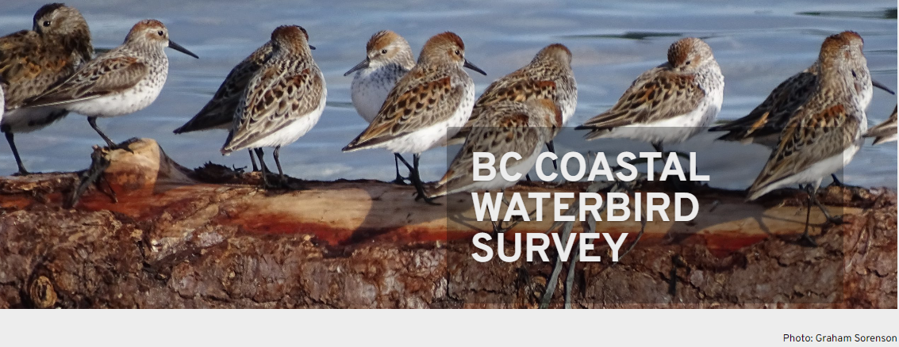

---
output:
  pdf_document: default
  html_document: default
---

# BCCWS {#BCCWS2}

[**British Columbia Coastal Waterbird Survey**]((https://www.birdscanada.org/bird-science/british-columbia-coastal-waterbird-survey))

## Quick Data Overview {#BCCWS2.1}

| Data        | British Columbia Coastal Waterbird Survey (BCCWS)                                                                                                      |
|--------------------------|----------------------------------------------|
| Owner       | Birds Canada/ Canada Wildlife Service                                                                                                                  |
| Status      | Active                                                                                                                                                 |
| Years       | 1999 - present                                                                                                                                         |
| Seasons     | Monthly survey, with a winter focus from Sept - April                                                                                                  |
| Sampling    | Coastal surveys along designated routes                                                                                                                |
| Data Access | Available directly in R, with permission from Birds Canada or through the [NatureCounts](https://naturecounts.ca/nc/default/searchquery.jsp) webportal |
| Contact     | [rtorrenta\@birdscanada.org](mailto:rtorrenta@birdscanada.org){.email}                                                                                 |

## Data Collection Protocol {#BCCWS2.2}

BCCWS data collection protocol can be found online [here](https://www.birdscanada.org/bird-science/british-columbia-coastal-waterbird-survey/bccws_resources).

In short, surveys have been conducted by volunteers using a standardized protocol and data collection [sheets](https://birdscanada.b-cdn.net/wp-content/uploads/2021/02/BCCWS_Datasheet.pdf). Shore-based counts are completed monthly on or near the second Sunday of each month from September to April. Surveys are complete within approximately 2 hour of high tide to maximize the opportunity for close observation. All waterbirds observed to a distance of 1 km from the high tide line are counted, except those that fly through without stopping. In the case of larger flocks, numbers are estimated by counting individuals and species in groups and scaling up (see [Training Module for Volunteers](https://birdscanada.b-cdn.net/wp-content/uploads/2020/02/BCCWS-Training-Module.pdf)). Data are entered through a customized online data entry system available on the Birds Canada website, [NatureCounts](https://www.birdscanada.%20org/birdmon/default/main.jsp). Observations are processed using the eBird data filters to flag rare species and high counts during observer data entry, and records are manually reviewed for form accuracy.

## Avian Data Collected {#BCCWS2.3}

Observation counts of waterbird and raptor seen during a survey are compiled at the scale of the route (i.e., the maximum count per species) on each monthly survey. These observations are divided into inland, near shore (shoreline to 500m out from high tide), off shore (beyond 500m), and total counts. The dataset is not zero-filled.

Taxonomic Authority = [eBird/Clements v2019](https://www.birds.cornell.edu/clementschecklist?__hstc=60209138.6f747e6e23a2f1b7014cf372ca892894.1544132358313.1566237656917.1566240564794.714&__hssc=60209138.3.1566240564794&__hsfp=2467889448)

## Auxiliary Data Collected {#BCCWS2.4}

-   Observer information: observer ID

-   Survey information: time observation started, time observation ended, duration in hours

-   Survey condition: precipitation, % cloud, sea condition, tide state, tide movement, visibility, survey equipment, human activity (all categorical)

## Data Access, Permission, and Format {#BCCWS2.5}

Data can be freely accessed through the NatureCounts data [download](https://naturecounts.ca/nc/default/searchquery.jsp) portal or directly through the naturecounts R package, which I will demonstrate later in this chapter. The BCCWS is Access Level 4 dataset, meaning a data request form must be submitted. This is not meant to be a barrier, rather a means of keeping track of who is using the data and for what purposes.

Data are formatted using a standardized schema that is a core standard of the [Avian Knowledge Network](https://avianknowledge.net/) and which feeds into [GBIF](https://www.gbif.org/). This format is called the Bird Monitoring Data Exchange ([BMDE](https://naturecounts.ca/nc/default/nc_bmde.jsp)), which includes 169 core fields for capturing all metric and descriptors associated with bird observations.

## Data Use Considerations {#BCCWS2.6}

The data are collected using a standardize protocol, by trained citizen-science volunteers. This standardization is a strength of this datasets for making inferences about coastal waterbirds in the Canadian Salish Sea.

The repeated sampling design of the BCCWS makes this dataset suitable for an occupancy modelling framework, in which the probability of detection can be modeled alongside occupancy. Auxiliary data collected during each survey are suitable for the detection process of the model. Using mean counts in abundance on a route within a year, these data have also been recently used to assess coastal waterbird [trends](https://www.ace-eco.org/vol15/iss2/art20/).

Measures of effort are innate to the dataset. Survey duration (column `DurationinHours`) and survey area can be used to make effort correction to counts. Survey areas for each survey route has been provided as a .shp file in the `Data` folder in this project directory. The number of years an observer has been doing the survey can also be used to correct for observer bias.

There is spatial inbalance in the sampling design, with more routes occurring in the southern Salish Sea and around areas that are inhabited by people. Hard to access locations are no well sampled, nor are regions further to the north. Since this survey is shore-based, there will be a species sampling bias. Specifically, birds that use near shore habitats will be detected and counted more often than birds which use offshore habitats. This dataset may therefore be less suitable for modelling at-sea habitat use, for example.

The dataset should be filtered prior to use. For example, rare species should be removed since they are not necessarily representative (e.g., those which occur on \<1% of routes). Depending on the analysis, routes that are run for only a short time (e.g., \<3 years) or which have incomplete data (e.g., \<8 months per year or \<4 core winter month) may be considered for removal.This dataframe is not zero-filled. It is up to the data user to zero-fill the martix prior to use.

