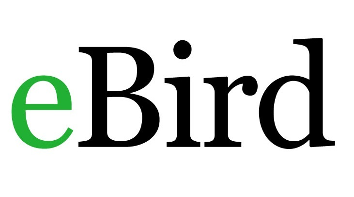

---
output:
  pdf_document: default
  html_document: default
---

# eBird {#eBird7}

[**eBird**](https://ebird.org/home)

## Quick Data Overview {#eBird7.1}

| Data        | eBird/ eBird Canada                                                                                                                                                 |
|--------------------------|----------------------------------------------|
| Owner       | Cornell/ Birds Canada                                                                                                                                               |
| Status      | Active                                                                                                                                                              |
| Years       | 2002-present                                                                                                                                                        |
| Seasons     | All year                                                                                                                                                            |
| Sampling    | Checklist: stationary, traveling, incidental, historic                                                                                                              |
| Data Access | Online access through [Cornell](https://science.ebird.org/en/status-and-trends/download-data) or [NatureCounts](https://naturecounts.ca/nc/default/searchquery.jsp) |
| Contact     | [ebird\@cornell.edu](mailto:ebird@cornell.edu){.email}                                                                                                              |

## Data Collection Protocol {#eBird7.2}

eBird is a checklist based citizen-science program. There are [three main data collection protocol](https://support.ebird.org/en/support/solutions/articles/48000950859-guide-to-ebird-protocols#anchorStationarys)s, including:

-   Stationary: objective is birding, a single fixed location, with specified start and end time
-   Travelling: objective is birding, specified start and end time, and known distance of travel
-   Incidental: objective is not on birding, but species was identified and submitted. Not a complete checklist.

There are also several specialized protocols:

-   Pelagic: applies to checklists that are made farther than two miles offshore on oceans, seas, or large lakes. *These data are likely most valuable to this initiative*.
-   Banding: birds observed because they were captured for banding. Detection rates from banding are very different from normal birding
-   Nocturnal Flight Call (NFC): nighttime contact calls of migrating songbirds as they pass through on their way to breeding grounds

## Avian Data Collected {#eBird7.3}

eBird data are collected and organized around the concept of a checklist, representing observations from a single birding event, such as a 1 km walk through a park or 15 minutes observing bird feeders in a backyard. Each checklist contains a list of species observed and the counts of the number of individuals seen of each species.

Taxonomic Authority = [eBird/Clements v2019](https://www.birds.cornell.edu/clementschecklist?__hstc=60209138.6f747e6e23a2f1b7014cf372ca892894.1544132358313.1566237656917.1566240564794.714&__hssc=60209138.3.1566240564794&__hsfp=2467889448)

## Auxiliary Data Collected {#eBird7.4}

-   Observer information: observer ID

-   Survey information: time of day, checklist duration, distance traveled, and number of observers.

## Data Access, Permission, and Format {#eBird7.5}

eBird offers free access to its data via prepackaged and customizable file downloads and APIs. For all downloads and APIs, eBird require first that you submit a request with a short abstract so they can learn more about how eBird data are being used. eBird date requests can be made to Cornell [here](https://ebird.org/data/request). There is also an option to request eBird Canada data through the NatureCounts platform by making a request [here](https://naturecounts.ca/nc/default/searchquery.jsp). However, for the purposes of this transboundary project, the data example will be using eBird data accessed through Cornell.

-   eBird Basic Dataset (EBD) is the core dataset for accessing all raw eBird observations and associated metadata.There are several R packages available for summarizing data, including one that is managed by the Cornell Lab specifically for working with the EBD dataset: [auk: eBird Data Extraction and Processing with AWK](https://cornelllabofornithology.github.io/auk/).

-   eBird Observational Dataset (EOD) is made available through [GBIF](https://www.gbif.org/) and includes species, date, and location. Additional metadata associated with these observations, including sampling event data (i.e., effort), are not included through this platform.

[eBird's Terms of Use](https://www.birds.cornell.edu/home/ebird-data-access-terms-of-use/) are clearly outlined on their webpage, and should be reviewed prior to requesting data.

eBird data are not zero-filled. Instructions on zero-filling the dataset can be found [here](https://cornelllabofornithology.github.io/ebird-best-practices/ebird.html#ebird-zf).

Additional information on the metadata strucutre can be found in the "eBird Basic Dataset Metadata (v1.14) " pdf, which is saved in the `Data` folder of this directory.

## Data Use Considerations {#eBird7.6}

eBird is a semi-structured project, having flexible, easy to follow protocols that attract many participants, making it the largest avian citizen science dataset globally. However, despite the strengths of eBird's size, species observations collected through citizen science projects present a number of challenges that are not found in conventional scientific data. The following are some of the primary challenges associated these data: taxonomic, spatial, and temporal biases, spatial precision, class inbalance, and variation in detection.

When working with semi-structured datasets like eBird, one approach to dealing with this variation is to impose some more consistent structure on the data by filtering observations on the effort variables. This reduces the variation in detectability between checklists. It is generally recommended that users restricting checklists to less than 5 hours long and 5 km in length, and with 10 or fewer observers.

Users of eBird data should review and adopt [Best Practices for Using eBird Data](https://cornelllabofornithology.github.io/ebird-best-practices/).

Recommended Citation: eBird Basic Dataset. Version: EBD_relSep-2022. Cornell Lab of Ornithology, Ithaca, New York. Month Year of Access.
